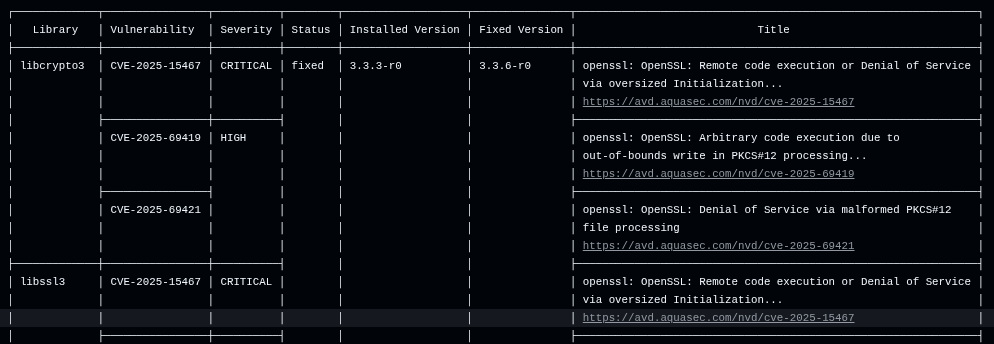
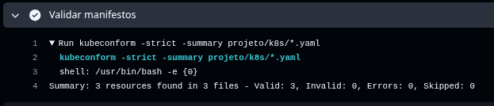

# 🔐 Segurança

Este documento descreve as práticas de segurança aplicadas e recomendadas para este projeto, considerando o uso de Docker, Kubernetes, Terraform e pipelines CI/CD.

---

## 🔑 Gerenciamento de segredos em produção

Para gerenciamento seguro de credenciais e informações sensíveis:

- Utilização de **GitHub Secrets** para armazenar variáveis sensíveis usadas no pipeline (ex: Docker Hub, Terraform)
- Uso de **variáveis de ambiente** ao invés de hardcode no código
- Em ambientes produtivos, recomendável utilizar:
  - AWS Secrets Manager
  - AWS SSM Parameter Store
  - HashiCorp Vault
  - Kubernetes Secrets

### ✅ Boas práticas

- Nunca versionar segredos no repositório
- Rotacionar credenciais periodicamente
- Segregar segredos por ambiente (dev, staging, prod)

---

## 🚫 Como evitar exposição de credenciais

- Uso de **GitHub Actions com Secrets** (já implementado no projeto)
- Evitar:
  - Tokens em código
  - Credenciais em arquivos `.tf`, `.yaml`, `.env` versionados
- Uso de `.gitignore` e `.dockerignore` para evitar vazamento de arquivos sensíveis
- Utilização de autenticação moderna, estou utilizando o: **OIDC** ao invés de chaves estáticas

---

## 🐳 Segurança da imagem Docker

### Práticas aplicadas:

- Execução do container como **usuário não-root**
- Uso de imagem base oficial
- Scan de vulnerabilidades com **Trivy** no pipeline. Em uma das actions é possível identificar que o Trivy validou a versão do Alpine em uso pelo Dockerfile, o que posteriormente foi corrigido:

### 🔒 Melhorias recomendadas:

- Remover pacotes desnecessários
- Implementar **multi-stage build**
- Validar imagem antes do deploy (fail em vulnerabilidades críticas)

---

## 🛠️ Patch de vulnerabilidades com Copacetic

O projeto pode ser evoluído utilizando o :contentReference[oaicite:0]{index=0} para reforçar a segurança das imagens.

- O Copacetic permite **corrigir vulnerabilidades diretamente na imagem Docker sem rebuild completo** :contentReference[oaicite:1]{index=1}  
- Ele utiliza resultados de scanners como o Trivy para aplicar atualizações automaticamente :contentReference[oaicite:2]{index=2}  
- Cria uma nova camada de patch, reduzindo tempo e custo de atualização :contentReference[oaicite:3]{index=3}  

### Benefícios:

- Reduz o tempo de exposição a vulnerabilidades
- Permite corrigir imagens de terceiros
- Pode ser integrado ao pipeline CI/CD

---

## 📌 Considerações finais

A segurança deve ser tratada de forma contínua (DevSecOps), integrada desde o desenvolvimento até o deploy.

Este projeto já aplica boas práticas iniciais, como:
- Uso de secrets no GitHub
- Scan de vulnerabilidades com Trivy
- Execução segura de containers
- Uso de SSM na EC2 para evitar configuração de chave SSH
- Uso do AWS OIDC para evitar uso de AWS_ACCESS_KEY e SECRET_KEY, gerando um token temporário de acesso

E pode evoluir com:
- Patch automático de imagens (Copacetic)
- Gestão centralizada de segredos
- Políticas mais avançadas de acesso em cloud
- Separação dos ambientes. Ex: prod, stg, hml 

### Observações:
- Alguns itens foram ignorados dentro do tfsec por se tratar de um ambiente pouco complexo e/ou de testes. Em ambientes reais é ideal restringir o acesso (quando possível) e criar os logs de fluxo da VPC.

- Optei por utilizar o `kubeconform` na pipeline em vez de aplicar diretamente os manifestos com `kubectl apply`, pois o objetivo dessa etapa é validar a estrutura e conformidade dos arquivos Kubernetes antes do deploy.

O kubeconform permite validar os manifests de forma rápida e independente de um cluster, garantindo que erros de sintaxe ou incompatibilidade com a API do Kubernetes sejam detectados antecipadamente.

